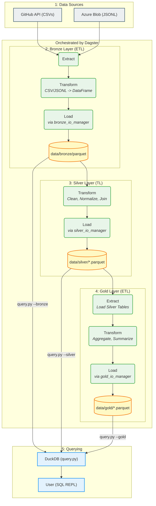

# Medallion ETL Pipeline

This project implements a complete ETL (Extract, Transform, Load) pipeline using the **Medallion Architecture** (Bronze, Silver, Gold). The entire pipeline is orchestrated as a set of assets using **Dagster**.

The pipeline ingests raw data from multiple sources (GitHub CSVs and Azure Blob Storage JSONL), processes it through cleaning and transformation layers, and produces aggregated, analysis-ready datasets in the Gold layer.

All data at rest is stored in Parquet format.

**Note:** Python 3.12.9 is required to run this project.

## Table of Contents
1. [Architecture](#architecture)
2. [Setup](#setup)
3. [How to Run](#how-to-run)
4. [How to Query Data](#how-to-query-data)
5. [Layer-Specific Documentation](#layer-specific-documentation)

## Architecture

The pipeline follows a three-layer Medallion architecture, orchestrated by Dagster.



## Setup

1. **Clone the repository:**

   ```sh
   git clone <your-repo-url>
   cd medallion_etl
   ```

2. **Create and activate a virtual environment:**

   ```sh
    # Create virtual environment (all platforms)
    python3.12 -m venv .venv
   
    # Activate virtual environment
    # For Linux/macOS:
    source .venv/bin/activate
   
    # For Windows (Command Prompt):
    .venv\Scripts\activate.bat
   
    # For Windows (PowerShell):
    .venv\Scripts\Activate.ps1
   ```

3. **Install dependencies:**

   ```sh
   pip install -r requirements.txt
   ```

4. **Configure environment variables:**
   
   Copy the example `.env` file and add your Azure SAS URL.

   ```sh
   cp .env.example .env
   ```

   Then, edit `.env` and set the `AZURE_SAS_URL` variable.

## How to Run

This pipeline can be executed using Dagster or as standalone Python scripts.

### 1. Running with Dagster (Recommended)

Use the Dagster webserver to visualize and run the pipeline:

```sh
dagster dev -f definitions.py
```

This will launch the Dagit UI at **http://127.0.0.1:3000**. 

**To run the entire pipeline:**
1. Open your browser and navigate to http://127.0.0.1:3000
2. Go to the **Lineage** tab on the Left side of the interface
3. Locate the **Materialize all** button on the extreme Right(Black)
4. Click it to run the entire pipeline

You can also materialize individual assets, view the pipeline structure, and monitor runs from this interface. The main pipeline definition (`defs`) is located in `definitions.py`.

The Lineage Tab will show you the following assets:

```mermaid
flowchart LR
    subgraph bronze_extract [bronze_extract]
        raw_csv_files
        raw_jsonl_files
    end

    subgraph bronze [bronze]
        b_raw_stores[raw_stores]
        b_raw_items[raw_items]
        b_raw_customers[raw_customers]
        b_raw_orders[raw_orders]
        b_raw_products[raw_products]
        b_raw_supplies[raw_supplies]
        b_support_tickets[support_tickets]
    end

    subgraph silver [silver]
        s_stores[stores]
        s_order_items[order_items]
        s_customers[customers]
        s_orders[orders]
        s_support_tickets[support_tickets]
        s_products[products]
        s_supplies[supplies]
    end

    subgraph gold [gold]
        g_aov[aov_by_store_month]
        g_summary[orders_summary]
    end

    %% Bronze Extract to Bronze
    raw_csv_files --> b_raw_stores
    raw_csv_files --> b_raw_items
    raw_csv_files --> b_raw_customers
    raw_csv_files --> b_raw_orders
    raw_csv_files --> b_raw_products
    raw_csv_files --> b_raw_supplies
    raw_jsonl_files --> b_support_tickets

    %% Bronze to Silver
    b_raw_stores --> s_stores
    b_raw_items --> s_order_items
    b_raw_customers --> s_customers
    b_raw_orders --> s_orders
    b_raw_products --> s_products
    b_raw_supplies --> s_supplies
    b_support_tickets --> s_support_tickets

    %% Silver to Gold
    s_stores --> g_aov
    s_order_items --> g_aov
    s_orders --> g_aov

    s_customers --> g_summary
    s_orders --> g_summary
    s_support_tickets --> g_summary
    ```

### 2. Running Standalone Scripts (If, Dagster fails)

You can also run the ETL process for each layer manually.

1. **Run the Bronze layer:**

   ```sh
   python -m bronze.run_bronze
   ```

2. **Run the Silver layer:**

   ```sh
   python -m silver.run_silver
   ```

3. **Run the Gold layer:**

   ```sh
   python -m gold.run_gold
   ```

## How to Query Data

An interactive SQL query tool is included, powered by DuckDB. This allows you to directly query the Parquet files in any layer.

**Start the query REPL:**

- **To query the Gold layer:**

  ```sh
  python query.py --gold
  ```

- **To query the Silver layer:**

  ```sh
  python query.py --silver
  ```

- **To query the Bronze layer:**

  ```sh
  python query.py --bronze
  ```

**Example query:**

Once the REPL starts, you can type SQL queries:

```sql
sql> SELECT * FROM aov_by_store_month LIMIT 5;
```

- Type `.vertical` for a readable list view (default) or `.horizontal` for a table view.
- Type `q` or `exit` to quit.

## Layer-Specific Documentation

For a detailed breakdown of the transformation logic, business rules, and schemas for the Silver and Gold layers, please refer to their dedicated README files:

* [**Silver Layer README**](./silver/SILVER_README.md)
* [**Gold Layer README**](./gold/GOLD_README.md)